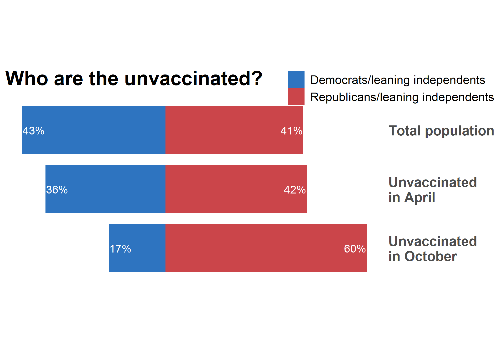

This is a quick re-visualization of a much-maligned plot from [the Washington Post](/README_files/PUP6SZ3SIZEGNPXBNVZ3SEEZ6Q.png){width=50%} using Kaiser Family Foundation polling data.


```r
dat <- tribble(
  ~Population,              ~PoliticalOrientation,              ~Percent,
  "Total population",       "Democrats/leaning independents",   43,
  "Total population",       "Republicans/leaning independents", 41,
  "Unvaccinated (October)", "Democrats/leaning independents",   17,
  "Unvaccinated (October)", "Republicans/leaning independents", 60,
  "Unvaccinated (April)",   "Democrats/leaning independents",   36,
  "Unvaccinated (April)",   "Republicans/leaning independents", 42
  ) %>% 
  mutate(
    PercentLabel = Percent,
    Percent = if_else(
      PoliticalOrientation == "Democrats/leaning independents",
      Percent * -1,
      Percent
    )
  )

g <- dat  %>% 
  ggplot(
    aes(
      x = Percent,
      y = Population,
      fill = PoliticalOrientation,
      color = PoliticalOrientation,
      label = scales::percent(PercentLabel, scale = 1, accuracy = 1)
    )
  )

g +
  geom_col() +
  geom_text(
    data = subset(
      dat, 
      PoliticalOrientation == "Democrats/leaning independents"
    ),
    color = "white",
    hjust = 0
  ) +
  geom_text(
    data = subset(
      dat, 
      PoliticalOrientation == "Republicans/leaning independents"
    ),
    color = "white",
    hjust = 1
  ) +
  scale_fill_manual(values = c("#2E74C0", "#CB454A")) +
  scale_color_manual(values = c("#2E74C0", "#CB454A")) +
  scale_y_discrete(limits = rev, position = "right") +
  ggtitle("Who are the unvaccinated?") +
  theme_minimal() +
  theme(
    axis.title = element_blank(),
    axis.text.x = element_blank(),
    panel.grid = element_blank(),
    legend.direction = "vertical",
    legend.position = c(1.125, .98),
    legend.title = element_blank(),
    legend.text = element_text(size = 10),
    axis.text.y = element_text(size = 12),
    plot.title = element_text(size = 14, face = "bold", hjust = 0)
  )
```

<!-- -->

* Compared to their prevalence in the overall US population, Democrats/leaning independents are **under-represented** among the unvaccinated--and even moreso in October than in April 2021.

* Compared to their prevalence in the overall US population, Republicans/leaning independents are **over-represented** among the unvaccinated as of October, 2021.


```r
sessionInfo()
```

```
## R version 3.6.2 (2019-12-12)
## Platform: x86_64-apple-darwin15.6.0 (64-bit)
## Running under: macOS Catalina 10.15.7
## 
## Matrix products: default
## BLAS:   /Library/Frameworks/R.framework/Versions/3.6/Resources/lib/libRblas.0.dylib
## LAPACK: /Library/Frameworks/R.framework/Versions/3.6/Resources/lib/libRlapack.dylib
## 
## locale:
## [1] en_US.UTF-8/en_US.UTF-8/en_US.UTF-8/C/en_US.UTF-8/en_US.UTF-8
## 
## attached base packages:
## [1] stats     graphics  grDevices utils     datasets  methods   base     
## 
## other attached packages:
## [1] forcats_0.5.1   stringr_1.4.0   dplyr_1.0.7     purrr_0.3.4    
## [5] readr_2.1.0     tidyr_1.1.4     tibble_3.1.6    ggplot2_3.3.5  
## [9] tidyverse_1.3.1
## 
## loaded via a namespace (and not attached):
##  [1] tidyselect_1.1.1 xfun_0.11        haven_2.4.3      colorspace_1.4-1
##  [5] vctrs_0.3.8      generics_0.0.2   htmltools_0.4.0  yaml_2.2.0      
##  [9] utf8_1.1.4       rlang_0.4.12     pillar_1.6.4     glue_1.5.0      
## [13] withr_2.4.2      DBI_1.1.0        dbplyr_2.1.1     modelr_0.1.8    
## [17] readxl_1.3.1     lifecycle_1.0.1  munsell_0.5.0    gtable_0.3.0    
## [21] cellranger_1.1.0 rvest_1.0.2      evaluate_0.14    labeling_0.3    
## [25] knitr_1.26       tzdb_0.2.0       fansi_0.4.1      broom_0.7.10    
## [29] Rcpp_1.0.3       scales_1.1.1     backports_1.1.5  jsonlite_1.7.2  
## [33] farver_2.1.0     fs_1.3.1         hms_1.1.1        digest_0.6.23   
## [37] stringi_1.4.4    grid_3.6.2       cli_3.1.0        tools_3.6.2     
## [41] magrittr_2.0.1   crayon_1.4.2     pkgconfig_2.0.3  ellipsis_0.3.2  
## [45] xml2_1.3.2       reprex_2.0.1     lubridate_1.8.0  rstudioapi_0.13 
## [49] assertthat_0.2.1 rmarkdown_2.0    httr_1.4.2       R6_2.4.1        
## [53] compiler_3.6.2
```

